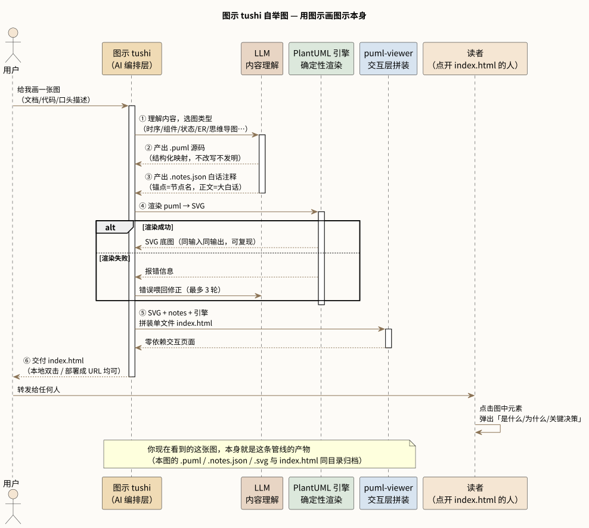

# 图示 tushi

> 输入文档/代码/描述 → AI 写 PlantUML + 白话注释 → 确定性渲染 → 单文件交互式 HTML

**[→ 打开交互版演示](https://h2o502.github.io/tushi/)**（用图示画图示本身：点图中任意元素，弹出白话解释）

## 30 秒看懂工作管线



- **LLM 职责**：内容 → PlantUML DSL + 白话 notes（不改写内容）
- **渲染职责**：PlantUML 确定性引擎（本地 CPU 免费，毫秒级）
- **交互职责**：自研 puml-viewer（点击热区弹白话浮层，工具栏缩放）
- 渲染失败 → 报错喂回 LLM 重试（最多 3 轮）

## 解决什么问题

需要把产品架构、知识体系、复杂流程「画出来给人看」时，常见做法有三种，各有硬伤：

- **AI 直出图片**：LLM 排版能力弱，字挤线穿，同一输入两次结果不一样
- **手绘/白板工具**：好看，但改一次图重画一次，无法随代码库演进
- **静态架构图**：图能看，但读者只能看，点不了、问不了

图示 tushi 的做法是让每个环节只干自己最强的事：

| 环节 | 谁来干 | 为什么 |
|---|---|---|
| 内容理解 → PlantUML DSL | LLM | puml 是训练语料充分的成熟 DSL，母语级，一次成型 |
| DSL → SVG 排版 | PlantUML 引擎 | 二十年打磨的确定性渲染，同输入同输出，可复现 |
| SVG → 交互层 | 自研 viewer | 热区 + 白话浮层 + 缩放，纯前端零依赖 |

## 交付物

**一个单文件 index.html**：内嵌 SVG 底图 + 白话注释数据 + 交互引擎。

- 零网络请求、零外部依赖，发给谁都能打开
- 读者点击图中任意元素，弹出这个组件「是什么/为什么存在/关键决策」的白话解释
- 工具栏缩放（默认原始宽度自由画布，左右滚动）+ 高亮点位
- 源文件 .puml 是纯文本：git 可 diff，手改一行重渲染，图与知识库共同演进

## 使用

```bash
python3 scripts/tushi.py render --puml x.puml --notes x.notes.json --title 标题
```

notes JSON 格式：

```json
{ "notes": [
  { "key": "cachePriceClass",
    "mode": "prefix",
    "title": "价层门控",
    "body": "这个模型有没有缓存优惠？有的动一个字缓存就失效，没有的删垃圾白省钱" } ] }
```

- key/keys：匹配 SVG `<text>` 元素（参与者名/节点名）
- mode：exact | prefix（默认）| contains | regex
- title：点击热区弹出的浮层标题

## 重新生成演示

```bash
bash scripts/make-demo.sh   # 重新渲染 docs/demo/ 下的自举演示图
```

## 依赖

- Java 运行时（JRE 11+）
- PlantUML jar（首次使用自动下载约 22MB，或 `PLANTUML_JAR` 环境变量指定）
- Python 3.8+（仅标准库）

## 适用场景

- 「画个架构图」「把这个流程可视化」「给用户讲清楚这个系统」
- 交接文档、评审材料、新人 onboarding、周报汇报
- 任何需要把复杂逻辑变成**别人能看懂、还能点着问**的图的时刻

## License

MIT
